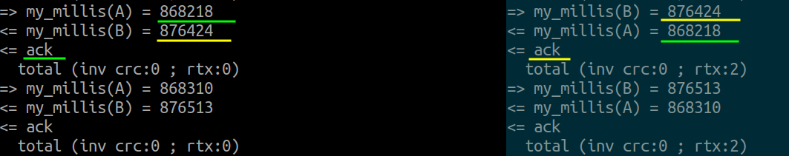

# iot-serial-intercomm

<!-- TOC -->
* [Description](#description)
* [API](#api)
* [Quickstart](#quickstart)
* [Upload/Debug](#uploaddebug)
<!-- TOCEND -->

## Description

Reliable two host serial communication.

Features:
- send custom data (max len: 65536)
- header and data with internet checksum
- tunable retransmit ( IC_RESEND_TRIES_MAX, IC_RESEND_INTERVAL_MS )

## API

- [classes](data/api/index_classes.md)

## Quickstart

The example01 shows two host implementation ( host A, host B ) corresponding to two nucleo F446RE configured as follow:

- host A
    - uses Serial1 (rx:RB7, tx:PA9) for communication
- host B
    - uses Serial3 (rx:PC11_ALT1, tx:PC10_ALT1) for communication

- each host transmit its [host-protocol.h](examples/example01/host-protocol.h) info, containing host millis() to other
- each host print received other host protocol info using `rxDataCallback` callback
- after each send `while (!ic.ackReceived()) { ... }` loop ensure packet is acknowledge by counterpart

## Upload/Debug

- to upload two board simultaneosly connected must configure `custom_hla_serial` id in platformio.ini
- select which environment with Platformio: Switch Project Environment
- this allow start two debug session ( use CTRL+ALT+B to ensure rebuild and reload may required ) then hit F5
